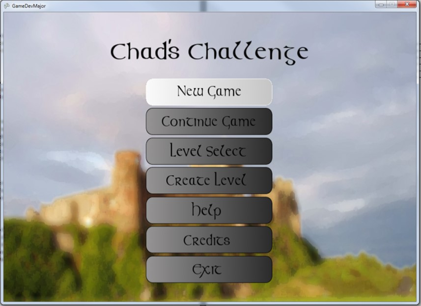
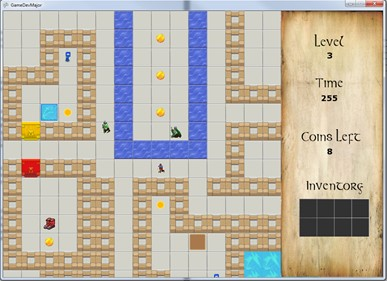
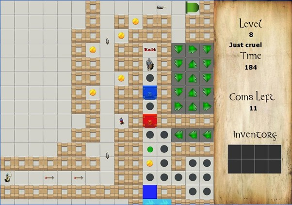
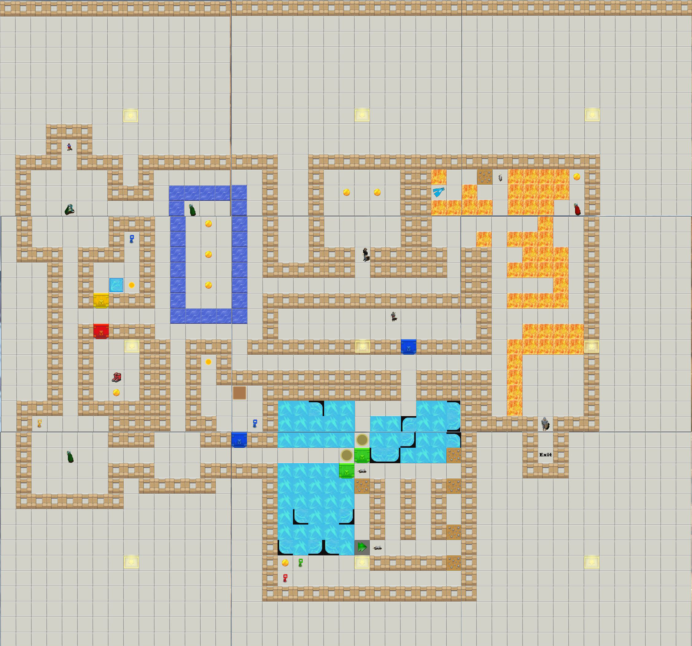

# Chads Challenge
 A game developed in 2011 using XNA for the Game Development topic.

The game was developed by Peter Mitchell, Brett Mitchell, Kane Stone, and Phil Lavender.

It is a Chip's Challenge clone that includes a level editor and some unique levels.

The Chads Challenge folder has an executable already compiled version of the game. The SourceCode directory contains all the code and assets.

([YouTube Level Editor Demo](https://youtu.be/dIvHmNC0zoc)) ([Youtube Gameplay Demo](https://youtu.be/BkuVXLOpa20))

Note that to run game you may need to download the XNA Framework Redistributable: https://www.microsoft.com/en-au/download/details.aspx?id=20914

If you want to compile the code you will need the XNA SDK: https://www.microsoft.com/en-au/download/details.aspx?id=23714

